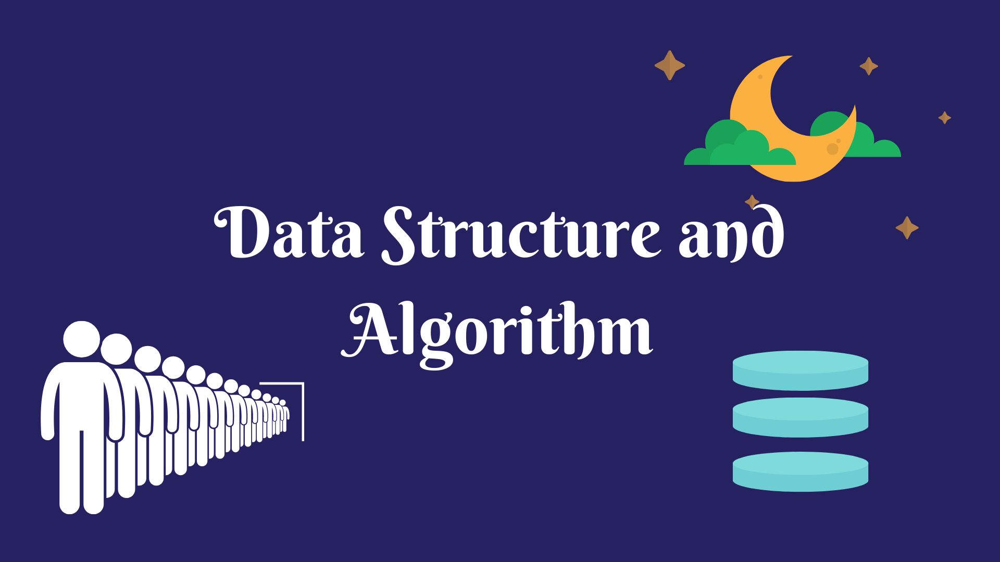

# Data Structure and Algorithm

## Based on C programming language

The repository contains the basic data structure codes done with the use of 2 main predefined data types:

* array

* linked list

Using these data types, the following data structures have been created

+ cirular linked list

+ doubly linked list

+ circular doubly linked list

+ stack

+ queue

+ priority queue

+ dequeu

+ binary tree

